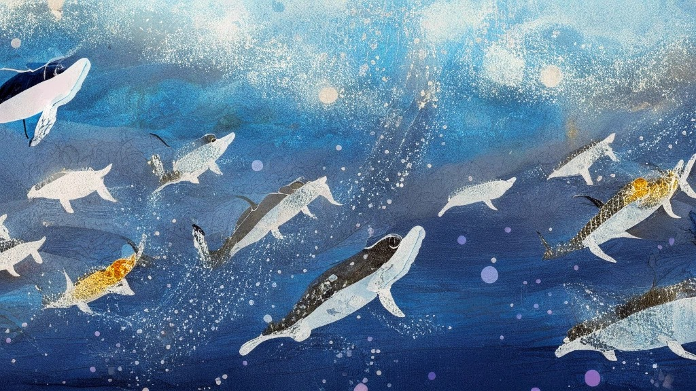
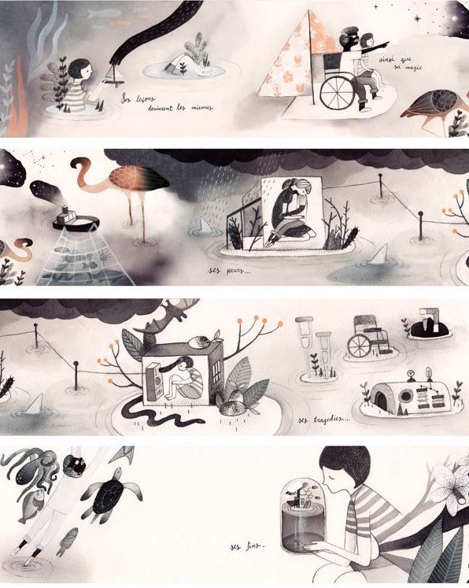

# CreativeMaking-LegendOfHanzi-UnitingThePastAndPresent

In this project, the primary objective was to explore the application of artificial intelligence (AI) tools in the field of illustration. To accomplish this, I utilized a specific AI art generator called Dreamlike, utilizing its default model known as Kandinsky 2.1. By leveraging this tool, I was able to upload multiple images and generate a composite outcome that incorporates various elements such as color palette, texture, and composition.

For the main resources of this project, I deliberately selected two distinct images. The first image was characterized by its grayscale tonality and possessed a prominently thick brush stroke texture. The second image featured elements such as butterflies, bridges, cranes, and clouds, executed in a traditional Chinese drawing style.

The intention behind this assignment was to gain practical experience in utilizing AI technologies within the realm of illustration. Through the employment of Dreamlike's AI art generator and the careful selection of the aforementioned images, I sought to explore the interplay of various artistic features and styles, including color, texture, and composition.

As an illustrator with previous experience and currently running my own brand, my typical workflow involves dedicating 3-5 working days to complete a single painting. This timeframe encompasses various pre-processing tasks such as conducting research, sketching drafts, determining composition, and creating color schemes. Only after completing these preparatory steps do I proceed to the actual drawing phase. In order to optimize my workflow, I am currently researching how artificial intelligence (AI) can assist me in specific steps of this process.

## My Mission of the Project
- 4 backgrounds: Game Cover, Background of 2 game levels, game endings background
- GIF sequences of Hanzi translation animation

## Use DREAMLIKE to generate background:
I have decided to utilize Dreamlike (https://dreamlike.art/create) as the primary tool for generating the desired images. The platform allows me to upload our own images and utilize the default Kandinsky2.1 model. Unlike models such as Midjourney and DALL.E, which rely on prompts to generate images, Dreamlike's approach involves using images to convey our intentions to the model. Additionally, I observed that Midjourney and DALL.E are more adept at creating images centered around a main character, whereas my objective is to create scenes with strong storytelling capabilities.

I used my own work and also others work to test how's the outcome:

| initial pic 1 | initial pic 2 | AI generate art | 4 features |
| --- | --- | --- | --- | 
|  my own drawing| my own drawing|| colour palette: pic1+pic2   texture: pic1 + pic2    main character: pic1 + pic2   composition: pic1 |
|  my own drawing| my own drawing|| colour palette: pic1+pic2   texture: pic1   main character: pic2   composition: pic2 |
|  my own drawing| my own drawing|| colour palette: pic1+pic2   texture: pic1   main character: pic1 + pic2   composition: pic2 |
|  my own drawing| PARESCHI Daniela Italy|| colour palette: pic1+pic2   texture: pic2   main character: pic2   composition: pic1 |
|  CUNHA Francisco Uruguay| Vendi Vernić|| colour palette: pic2   texture: pic2   main character: pic1   composition: pic1 + pic2 |
|  my own drawing| Leire Salaberria|| colour palette: pic1 + pic2   texture: pic2   main character: pic1   composition: pic1 |
|  Shi Tang| Marianne Ferrer|| colour palette: pic1 + pic2   texture: pic2   main character: pic2   composition: pic1 + pic2 |

The utilized model possesses the capability to extract color, texture, and composition from each image, while also allowing for the adjustment of weight from each image. Through my experimentation, I have discovered that achieving better results is possible when at least one of the source images contains simple content. This is important as it ensures that players can grasp the intended message of my image at first glance.

### Increase Quality and size
The images generated by Dreamlike are one-fourth the size of our desired specifications. Our game screen specifications are 1920*1080px at 72dpi. Therefore, we will need to use an AI tool, such as https://letsenhance.io/, that can increase the image size without compromising the resolution, improve the quality, and enhance clarity.

### Decomposing Image into Layers
After obtaining the photo with the correct resolution, I need to separate the elements within the image into individual layers. This allows me to adjust their size and position individually. I tried searching for an AI tool that can decompose an image into layers, but I only found a C++ library called "unblending" (https://github.com/yuki-koyama/unblending), which decomposes a target image into semi-transparent layers associated with advanced color-blend modes. This is not what I'm looking for. As a result, I ended up using Photoshop to manually isolate each element from the image and then adjust their positions and sizes.

Layer separation is crucial as it provides greater flexibility for adjusting the image and accommodates different layout requirements. Unfortunately, I haven't found any relevant tools for this purpose yet.

Since I couldn't find an AI tool for layer separation, I've been contemplating how such a tool could potentially be developed. I thought about the technology used in DALLE2, which can extrapolate images. If we could train an AI to detect objects within an image and separate them, and then use a technique similar to DALLE2 to fill in the blank areas, it should be possible to convert different objects within a single image into individual layers.

## Hanzi Transforming animation

In our game, when players reach the second level, we will show them the process of Chinese character evolution. Over the 3400 years of Chinese character history, there have been numerous changes. We have selected the most representative four stages: Oracle Bone Script, Bronze Script, Small Seal Script, and Regular Script (Kai Shu). We have created a gradient animation showcasing the transformation of these characters.

### Process
I started by searching for four different stages of font evolution online and resized them using Photoshop. Then, I used the Frame Interpolation feature on the Runway website (https://runwayml.com/) to generate a gradual animation of these four stages using AI.

Next, I converted the resulting MP4 file into a GIF format (20 FPS) using the website https://cloudconvert.com/mp4-to-gif. Finally, imported the GIF frames into Photoshop, removed the background, and saved them as PNG files.

## Conclusion
In general, AI-generated images can indeed replace the process of traditional artwork creation. While the Dreamlike website claims to provide users with commercial usage rights for the generated images, there may still be concerns if the initial image used belongs to someone else. After testing various combinations, I have a better understanding of what kind of features are extracted from different types of images. If I were to use AI-generated images, I could potentially try using sketches or hand-drawn drafts from my sketchbook as input and observe the results.

Another application that would have fewer copyright concerns is using AI-generated images as references for composition, color, texture, and layout. This can save a significant amount of time in the initial research phase.

By incorporating post-processing tasks such as resolution enhancement and layer separation, utilizing AI tools to generate new usable image files could potentially reduce the time required to create a painting from 3-4 working days to just 1 day or even half a day.

Furthermore, while working on this project, I came across a news article discussing AI copyright disputes.
https://automaton-media.com/en/nongaming-news/20220831-15350/

## Other AI-based tools help in specific aspects of drawing
### Huemint:
https://huemint.com/upload/
Huemint is a colour palette generator. The app uses machine learning to create unique colour combinations for your brand, website, or graphics.
### Fontjoy:
https://fontjoy.com/
I can pick out the perfect font combination based on my choice or exclusion of a particular font.

### Let's Enhance
https://letsenhance.io/
If a picture too small, and I need to resize it without losing quality.
